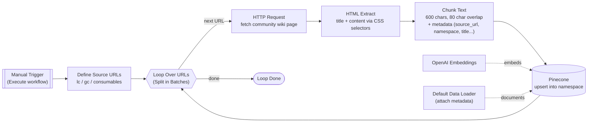
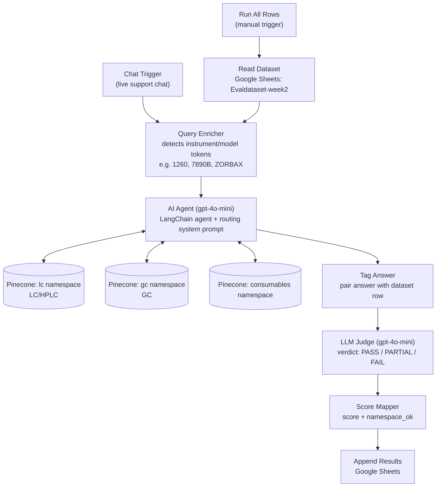

# Support RAG Agent

An n8n-based Retrieval-Augmented Generation (RAG) chatbot that helps customer support representatives answer technical questions about Agilent LC/HPLC, GC instruments, and consumables — grounded in Agilent's official Community Wiki knowledge base, with a built-in LLM-as-judge evaluation harness.

## Architecture

### 1. Knowledge Base Ingestion Pipeline

Crawls the Agilent Community Wiki, chunks the content, and upserts embeddings into Pinecone.



Source: [`workflows/Support Ingestion Final(1).json`](workflows/Support%20Ingestion%20Final%281%29.json) · URLs: [`eval/sources.md`](eval/sources.md)

### 2. Query & Evaluation Pipeline

A single LangChain agent serves two entry points: live support chat, and an automated evaluation run over a labeled dataset. Every answer — chat or eval — is graded by an LLM judge and logged to Google Sheets.



Source: [`workflows/AIAgentFinal(1).json`](workflows/AIAgentFinal%281%29.json)

The agent's system prompt routes queries to the right namespace (LC/HPLC → `lc`, GC → `gc`, columns/consumables → `consumables`, unsure → search all three), always cites `Source: [title] — [source_url]`, and falls back to "I could not find that in the Agilent knowledge base..." when nothing relevant is retrieved.

## Evaluation

### Methodology

Evaluation uses an **LLM-as-judge** approach against a 15-query labeled dataset ([`eval/Evaldataset-week2.xlsx`](eval/Evaldataset-week2.xlsx)) covering five categories:

| Category | Description |
|---|---|
| Standard | General topic questions, single namespace |
| Instrument# | Questions referencing a specific model number (e.g. 1260, 7890B, ZORBAX Eclipse Plus) |
| Cross-doc | Requires retrieving and synthesizing across multiple namespaces |
| Ambiguous | Underspecified queries that should prompt clarification or broad search |
| Out-of-KB | Questions with no answer in the knowledge base — agent must not hallucinate |

For each row, the **AI Agent** generates an answer, which is then graded by a separate **LLM Judge** call (gpt-4o-mini, temperature 0) against the row's `Expected_behavior` and `Expected_namespace`:

- **PASS** — fully satisfies the expected behavior (for Out-of-KB rows, returns the fallback message without inventing facts)
- **PARTIAL** — on-topic but incomplete, missing synthesis, missing citation, or only partially routed
- **FAIL** — wrong, hallucinated, off-topic, or fabricates an answer for an Out-of-KB query

Scores map PASS=1, PARTIAL=0.5, FAIL=0. The judge also returns `namespace_ok` (whether retrieval hit the expected namespace) and a one-sentence `reason`. Results are appended back to the Google Sheet for tracking across runs.

### Results

| Category | Queries | PASS | PARTIAL | FAIL | Score |
|---|---|---|---|---|---|
| Standard | 3 | 3 | 0 | 0 | 100% |
| Instrument# | 3 | 2 | 1 | 0 | 83.3% |
| Cross-doc | 3 | 3 | 0 | 0 | 100% |
| Ambiguous | 3 | 0 | 3 | 0 | 50% |
| Out-of-KB | 3 | 3 | 0 | 0 | 100% |
| **Overall** | **15** | **11** | **4** | **0** | **86.7%** |

Namespace routing accuracy (`namespace_ok`): **14/15 (93.3%)**

**Key findings:**
- The agent is strong on grounded retrieval: Standard, Cross-doc, and Out-of-KB categories all scored 100% — it correctly synthesizes across LC/GC/consumables namespaces and never fabricates answers when the knowledge base has no coverage.
- **Ambiguous queries are the weak spot (50%)**: for under-specified questions (e.g. "How do I fix flow problems?", "What is the best column for my application?"), the agent answers broadly across all namespaces instead of asking a clarifying question, as the rubric expected.
- One Instrument# query (7890B inlet troubleshooting) scored PARTIAL — the agent returned a general resource link rather than specific troubleshooting steps.
- One Out-of-KB query (Agilent's consumables return policy) correctly returned the fallback message (PASS) but was flagged `namespace_ok=FALSE` by the judge.

Full per-query queries, expected behavior, agent answers, and judge reasoning are in [`eval/Evaldataset-week2.xlsx`](eval/Evaldataset-week2.xlsx).

## Requirements

- An [n8n](https://n8n.io/) instance (self-hosted or cloud) with the LangChain nodes (`@n8n/n8n-nodes-langchain`) enabled
- An OpenAI API credential (used for chat, embeddings, and the LLM judge)
- A Pinecone API credential, with an index named `agilent-support-agent`
- A Google Sheets OAuth2 credential (used by the evaluation pipeline to read the dataset and append results)

## Setup

1. Import both workflow JSON files into your n8n instance (Workflows → Import from File)
2. Reconnect the OpenAI, Pinecone, and Google Sheets credentials to your own accounts
3. Run **Support Ingestion** once to populate the Pinecone index
4. Activate **AI Agent** and use its chat trigger for live support conversations
5. To run the evaluation: copy [`eval/Evaldataset-week2.xlsx`](eval/Evaldataset-week2.xlsx) to your own Google Sheet, point the "Read Dataset" / "Append Results" nodes at it, then trigger **Run All Rows**

## Project structure

```
support-rag-agent/
├── workflows/
│   ├── Support Ingestion Final(1).json   # Knowledge base ingestion pipeline
│   └── AIAgentFinal(1).json               # Support chat agent + evaluation pipeline
├── eval/
│   ├── Evaldataset-week2.xlsx             # 15-query eval dataset + LLM-judge results
│   └── sources.md                         # Knowledge base source URLs
└── README.md
```
